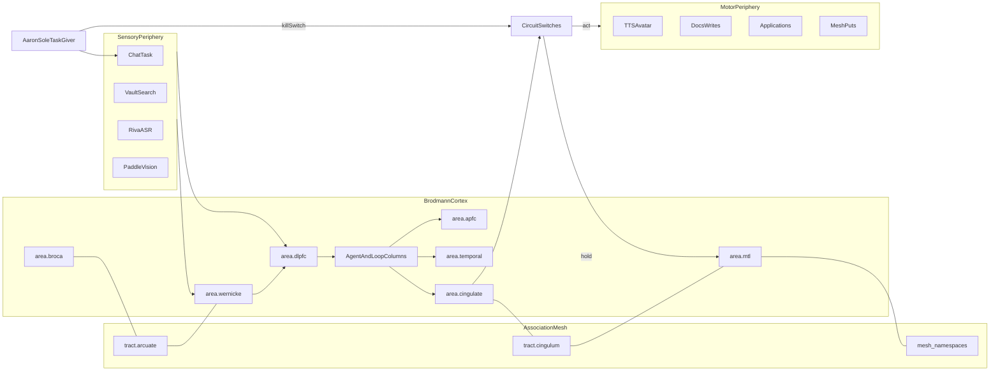

# Cam Connectome Architecture

Cam’s nervous system is now a **Brodmann functional cortex** with:

1. **Areas** — cytoarchitectonic / functional patches (`config/connectome/areas.json`)
2. **Columns (neurons)** — agents and repetitive loops inside areas (`neurons.json`)
3. **Tracts** — association fibers that *are* the neural mesh (`tracts.json`)
4. **Shared periphery** — sensory adapters + motor effectors (still common pathways)
5. **Circuit switches** — antagonistic act/hold gates (OFC / basal-ganglia analogs)

Fly CNS principles from Berg et al. *Cell* (2026) remain for periphery + switches;
higher centers are remapped onto human Brodmann association cortex.

Vault research: [[2026-09-16-Brodmann-neural-mesh-remap]] · [[2026-09-16-SwiftGuide-brain-map]]

## Literature basis

| Source | What Cam copies |
|---|---|
| Brodmann / Kenhub / Radiopaedia | Area numbering + primary functions |
| Association-cortex specialization ([PMC4598819](https://pmc.ncbi.nlm.nih.gov/articles/PMC4598819/)) | Flexible frontal–parietal binding of specialist networks |
| Jung et al. structural association connectome ([PMC5726605](https://pmc.ncbi.nlm.nih.gov/articles/PMC5726605/)) | Dense intra-area links; discrete inter-area tracts ≈ functional nets |
| Mountcastle columns · Thousand Brains / STAM | Agents + loops as recurrent columnar modules |
| Syncytial / Brain-Mesh models | Cross-area coherence layer (`mesh/*` + Hebbian tracts) |

## Layer map

| Biological idea | Cam system |
|---|---|
| Brodmann area | `area.*` functional hub |
| Cortical column | `neuron.*` agent or repetitive loop |
| Association fiber (arcuate, SLF, uncinate, cingulum, ILF, IFOF…) | `tract.*` + `mesh/*` namespace |
| Sensory periphery | `sense.*` adapters |
| Motor periphery / M1 | `motor.*` effectors via `area.motor` / premotor |
| Conflict monitoring (ACC) | `area.cingulate` + `neuron.qa_cycle` |
| Engrams (MTL) | `area.mtl` + vault + mesh |
| Circuit switches | `switch.*` (Aaron-flipped) |

## Agents and loops as neurons

From Mountcastle / STAM: columns are **recurrent** — they are not one-shot functions.

| Kind | Examples | Behavior |
|---|---|---|
| **Agent column** | `neuron.chief`, `neuron.research`, `neuron.vision` | Claims work; may spawn lateral mini-columns (subagents) |
| **Loop column** | `neuron.qa_cycle`, `neuron.speak_loop`, `neuron.watch_loop`, `neuron.mesh_sync_loop` | Keeps firing until hold/kill; Hebbian-writes mesh |

Unlimited subagent depth = unbounded columnar recruitment inside DLPFC (`neuron.delegate_burst`).

## Association tracts = neural mesh

| Tract | Ends | Mesh |
|---|---|---|
| Arcuate | Wernicke ↔ Broca | `mesh/language` |
| SLF | Parietal ↔ DLPFC ↔ Broca | `mesh/frontoparietal` |
| Uncinate | OFC ↔ Temporal | `mesh/valuation` |
| Cingulum | ACC ↔ MTL ↔ DLPFC | `mesh/runs` |
| ILF | Visual ↔ Temporal | `mesh/vision` |
| IFOF | Visual ↔ aPFC/DLPFC | `mesh/projects` |
| Callosal-like mesh | all areas | `mesh/*` + persist export/import |

Hebbian rule: completed **act** pathways strengthen tract weights; QA veto / kill weakens them.

## End-to-end flow



## Functional areas (abbrev.)

| Area | Brodmann | Cam |
|---|---|---|
| `area.dlpfc` | BA9/46 | chief + router |
| `area.apfc` | BA10 | cartography, docs, prospective plans |
| `area.ofc` | BA11 | boundaries, identity, kill valuation |
| `area.broca` | BA44/45 | outbound language / presence |
| `area.wernicke` | BA22/39/40 | language comprehension |
| `area.parietal` | BA5/7 | life-ops / calendar |
| `area.temporal` | BA20/21/37 | research + careers |
| `area.visual` | BA17–19 | vision |
| `area.auditory` | BA41/42 | ASR |
| `area.mtl` | MTL | memory curator / mesh engrams |
| `area.cingulate` | BA24/32 | QA / conflict loops |

Legacy `center.*` ids remain as aliases in `centers.json` (`maps_to` → area).

## Circuit switches

Unchanged policy: Aaron flips; Cam does not accept other operators.
See `config/connectome/switches.json` (tasking, autonomy, outbound, careers, presence, identity, ios_capture, kill).

## Live visualization

**3D cortex (primary):** `visualizations/connectome/index.html`

- Orbit / spin in space (drag)
- Rewindable plasticity tape (scrubber) to inspect tract mesh errors
- LTP / LTD / prune weights + MTL neurogenesis columns
- Flat 2D fallback: `visualizations/connectome/flat.html`

```bash
bash scripts/serve-connectome-viz.sh
# http://127.0.0.1:8765/visualizations/connectome/

# Seed plasticity tape / neurogenesis
python3 scripts/connectome-plasticity.py --sense sense.chat.aaron
python3 scripts/connectome-plasticity.py --error missing_edge --sense sense.careers.listing
python3 scripts/connectome-plasticity.py --neurogenesis && python3 scripts/connectome-plasticity.py --mature
```

Plasticity rules: `config/connectome/plasticity.json`  
Research: `vault/04-Research/2026-09-16-Neuroplasticity-neurogenesis-mesh.md`

## Files

- `config/connectome/areas.json` — Brodmann areas  
- `config/connectome/neurons.json` — agents + loops as columns  
- `config/connectome/tracts.json` — association mesh fibers  
- `config/connectome/plasticity.json` — LTP/LTD/prune + MTL neurogenesis  
- `config/connectome/hotspots.json` — short-path sense→area→switch→motor chains  
- `config/connectome/synapses.json` — allowed edges  
- `config/connectome/centers.json` — legacy aliases  
- `config/connectome/mindmap.json` — SwiftGuide dual-lens trees  
- `scripts/connectome-route.py` / `connectome-check.py` / `connectome-simulate.py` / `connectome-plasticity.py`
