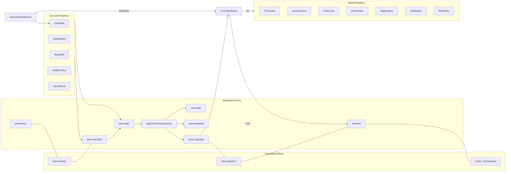

# Cam Connectome Architecture

Cam’s nervous system is now a **Brodmann functional cortex** with:

1. **Areas** — cytoarchitectonic / functional patches (`config/connectome/areas.json`)
2. **Columns (neurons)** — agents and repetitive loops inside areas (`neurons.json`)
3. **Tracts** — association fibers that *are* the neural mesh (`tracts.json`)
4. **Shared periphery** — sensory adapters + motor effectors (still common pathways)
5. **Circuit switches** — antagonistic act/hold gates (OFC / basal-ganglia analogs)

Fly CNS principles from Berg et al. *Cell* (2026) remain for periphery + switches;
higher centers are remapped onto human Brodmann association cortex.

Vault research: [[2026-09-16-Brodmann-neural-mesh-remap]] · [[2026-09-16-SwiftGuide-brain-map]] · [[AGI-Daily-Scan]]

## Literature basis

| Source | What Cam copies |
|---|---|
| Brodmann / Kenhub / Radiopaedia | Area numbering + primary functions |
| Association-cortex specialization ([PMC4598819](https://pmc.ncbi.nlm.nih.gov/articles/PMC4598819/)) | Flexible frontal–parietal binding of specialist networks |
| Jung et al. structural association connectome ([PMC5726605](https://pmc.ncbi.nlm.nih.gov/articles/PMC5726605/)) | Dense intra-area links; discrete inter-area tracts ≈ functional nets |
| Mountcastle columns · Thousand Brains / STAM | Agents + loops as recurrent columnar modules |
| Syncytial / Brain-Mesh models | Cross-area coherence layer (`mesh/*` + Hebbian tracts) |
| Sensory neurons (eyes, antennae, etc.) | Input adapters: chat, vault, email, LinkedIn/Indeed, calendar, ASR, vision, arXiv/AGI, Cline |
| Nerve cord / motor periphery | Effectors: text, call, FaceTime, Jarvis CLI, **Cline**, docs, jobs, TTS/avatar, sLM/DL, tools |
| Higher brain centers | Cam chief + specialists + nullboiler + mesh/vault + **coding** / AGI scan / enhance |
| Cell types (~11k typed neurons) | Typed roles / subagents with contracts (`config/roles/`) |
| Synapses | Routed events on nulltickets (claim → events → transition) |
| Dimorphic circuit switches | Antagonistic routes: `act` vs `hold`, `send` vs `draft`, kill-switch |
| Male-specific hotspots | Careers, research, presence, life-ops, coding, AGI denser routing hubs |

## Layer map

| Biological idea | Cam system |
|---|---|
| Brodmann area | `area.*` functional hub |
| Cortical column | `neuron.*` agent or repetitive loop |
| Association fiber (arcuate, SLF, uncinate, cingulum, ILF, IFOF…) | `tract.*` + `mesh/*` namespace |
| Sensory periphery | `sense.*` adapters |
| Motor periphery / M1 | `motor.*` effectors via `area.motor` / premotor |
| Conflict monitoring (ACC) | `area.cingulate` + `neuron.qa_cycle` |
| Engrams (MTL) | `area.mtl` + vault + mesh |
| Circuit switches | `switch.*` (Aaron-flipped) |

## Agents and loops as neurons

From Mountcastle / STAM: columns are **recurrent** — they are not one-shot functions.

| Kind | Examples | Behavior |
|---|---|---|
| **Agent column** | `neuron.chief`, `neuron.research`, `neuron.vision` | Claims work; may spawn lateral mini-columns (subagents) |
| **Loop column** | `neuron.qa_cycle`, `neuron.speak_loop`, `neuron.watch_loop`, `neuron.mesh_sync_loop` | Keeps firing until hold/kill; Hebbian-writes mesh |

Unlimited subagent depth = unbounded columnar recruitment inside DLPFC (`neuron.delegate_burst`).

## Association tracts = neural mesh

| Tract | Ends | Mesh |
|---|---|---|
| Arcuate long (Catani) | Wernicke ↔ Broca | `mesh/language` |
| AF anterior / posterior | Broca↔IPL↔Wernicke | `mesh/language` |
| SLF I–III + FAT | Parietal ↔ DLPFC/Broca/SMA | `mesh/frontoparietal` + language |
| Uncinate + EmC + IFOF | Ventral semantic stream | `mesh/valuation` / `mesh/projects` |
| ILF + MdLF + VOF | Posterior ventral | `mesh/vision` |
| Cingulum + Fornix | ACC ↔ MTL ↔ DLPFC | `mesh/runs` / `mesh/memory` |
| Forceps minor/major | Commissural workspace sync | `mesh/workspace` |
| Callosal-like mesh | all areas | `mesh/*` + persist export/import |

Hebbian rule: completed **act** pathways strengthen tract weights **and** bump myelination; QA veto / kill weakens weights.

Parameters: `config/connectome/mesh-params.json` (memory tiers, MAP planning buses, dual-stream, ASI stance).  
Unified turn reasoning (plan): [CAM_REASONING.md](CAM_REASONING.md) · SGR [`integrations/sgr-agent-core`](../integrations/sgr-agent-core) · LitServe [`integrations/litserve`](../integrations/litserve) · `config/enhancement/reasoning-logic.json`.  
Research: `vault/10-Mesh-Distillates/2026-09-17-fasciculus-AGI-mesh.md`

## End-to-end flow



## Functional areas (abbrev.)

| Area | Brodmann | Cam |
|---|---|---|
| `area.dlpfc` | BA9/46 | chief + router |
| `area.apfc` | BA10 | cartography, docs, prospective plans |
| `area.ofc` | BA11 | boundaries, identity, kill valuation |
| `area.broca` | BA44/45 | outbound language / presence |
| `area.wernicke` | BA22/39/40 | language comprehension |
| `area.parietal` | BA5/7 | life-ops / calendar |
| `area.temporal` | BA20/21/37 | research + careers |
| `area.visual` | BA17–19 | vision |
| `area.auditory` | BA41/42 | ASR |
| `area.mtl` | MTL | memory curator / mesh engrams |
| `area.cingulate` | BA24/32 | QA / conflict loops |

Legacy `center.*` ids remain as aliases in `centers.json` (`maps_to` → area).

## Sensory periphery

Shared receptors. They do **not** decide behavior; they only emit typed spikes (events).

Examples:

- `sense.chat.aaron` — Aaron message / task  
- `sense.vault.hit` — smart-second-brain retrieval  
- `sense.careers.listing` — LinkedIn/Indeed item  
- `sense.calendar.event` — schedule signal  
- `sense.audio.transcript` — RIVA ASR  
- `sense.vision.detection` — PaddleDetection distillate  
- `sense.cline.result` — Cline coding-agent feedback  
- `sense.web.arxiv` / `sense.web.agi_feed` — AGI paper feeds  
- `sense.web.scholar` — Google Scholar literature + citations (SerpAPI)  
- `sense.arxiv.paper` / `sense.clock.daily` — AGI daily scan inputs  
- `sense.swiftguide.map` — SwiftGuide cartography  

## Higher centers (`config/connectome/centers.json`)

Where specialization lives (paper: dimorphism concentrates centrally). Legacy aliases map onto Brodmann areas; keep both naming schemes for routing.

| Center | Analog | Cam role |
|---|---|---|
| `center.chief` | Central complex / executive | Cam `chief` |
| `center.memory` | Mushroom-body-like association | `memory-curator` + mesh + vault |
| `center.research` | Evidence hotspot | `researcher` |
| `center.careers` | Opportunity hotspot | `careers` |
| `center.ops` | Life-ops hotspot | `ops` |
| `center.comms` | Social-motor planning | `comms` |
| `center.docs` | Document planning | `docs` |
| `center.coding` | Shared coding hotspot | `coding` + **all agents via Cline** |
| `center.vision` | Visual association | `vision` |
| `center.qa` | Proofreading / consistency | `qa` |
| `center.router` | Policy neuropil | nullboiler |
| `center.agi_scan` | Daily AI/AGI scan team | `agi-scout` (+ analyst/synthesist) |
| `center.enhance` | Enhancement proposals / gated apply | `capability-broker` |
| `center.capability` | Task completion brokerage | `capability-broker` |
| `center.info` | Cited information gather | `info-retriever` |
| `center.slm` | Small-LM cortex | `slm-runtime` |
| `center.dl` | Deep-learning cortex | `dl-enhance` |
| `center.tooling` | Tool create/run + agent bus | `tool-creator` / `tool-user` |

Recursive subagents = local interneuron bursts (**unlimited** count/depth; **privilege inheritance** — child ⊆ parent; all teams may spawn).

## Circuit switches

Paper: isomorphic sensory paths diverge via switches into antagonistic circuits.

| Switch | Default | Act route | Hold route |
|---|---|---|---|
| `switch.tasking` | Aaron-only | accept spike | ignore non-Aaron |
| `switch.autonomy` | standing ON | finish end-to-end | pause / ask Aaron |
| `switch.outbound` | autonomy | send/call/FaceTime | draft-only |
| `switch.careers_submit` | autonomy | submit application | keep draft |
| `switch.presence` | on-demand studio | ASR→Cam→TTS→Audio2Face | still portrait / text |
| `switch.research_scan` | standing ON | web_fetch + vault/mesh distill | pause daily scan |
| `switch.cam_enhance` | **hold** (Aaron) | apply Cam functionality | propose-only |
| `switch.slm_local` | standing ON | motor.slm | no local sLM |
| `switch.dl_local` | standing ON | motor.dl | no local DL |
| `switch.tooling` | standing ON | motor.tool + motor.swarm | no new tools |
| `switch.ios_capture` | as configured | iOS companion capture | hold |
| `switch.kill` | armed | all motor silenced | — |

Aaron flips switches; Cam does not accept other operators. Aaron has ultimate say on functionality apply.
See `config/connectome/switches.json`.

## Motor periphery (`config/connectome/motor.json`)

Effectors fire only after a switch resolves to **act**.

| Effector | Output |
|---|---|
| `motor.text` | SMS / iMessage / chat |
| `motor.call` | Phone call |
| `motor.facetime` | FaceTime |
| `motor.speak` | RIVA TTS + avatar face |
| `motor.jarvis` | Local CLI utilities |
| `motor.cline` | Cline coding agent (CLI/SDK/IDE) — all roles & workspaces |
| `motor.docs` | File/doc writes |
| `motor.jobs` | LinkedIn/Indeed apply |
| `motor.vault` | Obsidian note writes |
| `motor.calendar` | Calendar mutations |
| `motor.mesh` | Mesh KV puts / archives |
| `motor.web_fetch` | HTTP / arXiv / **Google Scholar** fetch (AGI scan / info) |
| `motor.enhance` | Apply Cam config/role/connectome/sLM-DL changes (Aaron-gated) |
| `motor.slm` | Local small-LM inference |
| `motor.dl` | Local DL embed/rerank/cluster |
| `motor.tool` | Run registered tool (team.tooling) |
| `motor.swarm` | Boss/worker synapse ops (assign/broadcast/resolve/spawn/terminate) |

## Hotspots (dense specialized subgraphs)

From the paper’s “male-specific connection hotspots” idea — Cam densifies routing here:

1. **Careers hotspot** — boards → rank → draft/submit → vault/careers  
2. **Research hotspot** — question → vault + **Google Scholar**/web → cited brief → mesh/research  
3. **Presence hotspot** — transcript → Cam reply → soft airy fluent English TTS → face  
4. **Life-ops hotspot** — calendar/chores → Jarvis/calendar motor  
5. **Coding hotspot** — Aaron task → coding center → QA → Cline across workspaces  
6. **AGI daily scan hotspot** — clock/arxiv/feeds/Scholar → agi_scan → enhance proposals → vault  
7. **Capability hotspot** — Aaron task → capability team → specialists/sLM/DL → done  
8. **Info hotspot** — question → vault→mesh→**Scholar**→web → cited answer  
8b. **Google Scholar hotspot** — `sense.web.scholar` → info/research → `motor.web_fetch`  
9. **sLM / DL hotspots** — local model assists + feedback into mesh  
10. **Tooling / swarm bus hotspots** — tool-creator→tool-user + privilege-aware agent messaging  
11. **Cartography / QA loop hotspots** — SwiftGuide maps + ACC conflict-monitoring cycles  

Defined in `config/connectome/hotspots.json`. See also [CAM_BRAIN.md](CAM_BRAIN.md), [AGI_RESEARCH_TEAM.md](AGI_RESEARCH_TEAM.md), and [HAAS_CAM_PATTERNS.md](HAAS_CAM_PATTERNS.md).

## Synapse protocol (implementation contract)

Every connection is a nulltickets-backed event:

```text
sense.*  --spike-->  area.* / center.*  --route-->  switch.*  --act|hold-->  motor.*
                 \--log--> run events + mesh
```

Rules:

1. No motor fire without a sensory or internal drive spike tied to an Aaron task/goal  
2. Every synapse writes an event (proofreading analog)  
3. QA can veto malformed chains before motor  
4. Kill switch severs all motor edges immediately  

## Runtime mapping to Null stack

| Connectome piece | Runtime |
|---|---|
| Synaptic cleft / durable graph | nulltickets |
| Routing policy | nullboiler |
| Neuron executors | nullclaw roles |
| Human master switch | Aaron (+ nullhub when live) |
| Long-term engram | smart-second-brain vault + mesh |
| Coding effector | Cline (`integrations/cline`) |
| Knowledge cartography | SwiftGuide (`integrations/swiftguide`) |
| Embodied voice/face motor | LLMAvatarTalk |

## Why this shape

- Matches the paper: periphery shared, center specialized, switches decide behavior  
- Keeps Cam efficient: specialists only in hotspots  
- Makes motor output **correspond** to mapped pathways, not ad-hoc tool calls  
- Preserves Aaron as the only task-giver while allowing standing autonomy on granted act routes  
- Brodmann areas + association tracts give a human-cortex lens on the same periphery/switches  

## Live visualization

**3D cortex (primary):** `visualizations/connectome/index.html`

- Orbit / spin in space (drag)
- Rewindable plasticity tape (scrubber) to inspect tract mesh errors
- LTP / LTD / prune weights + MTL neurogenesis columns
- Flat 2D fallback: `visualizations/connectome/flat.html`
- All wired repos light up as pathways fire (nullclaw, nulltickets, nullboiler, nullhub, Jarvis, Cline, PaddleDetection, LLMAvatarTalk, smart-second-brain, SwiftGuide, OpenClaw/Assistant- patterns).

```bash
bash scripts/serve-connectome-viz.sh
# http://127.0.0.1:8765/visualizations/connectome/

# Seed plasticity tape / neurogenesis
python3 scripts/connectome-plasticity.py --sense sense.chat.aaron
python3 scripts/connectome-plasticity.py --error missing_edge --sense sense.careers.listing
python3 scripts/connectome-plasticity.py --neurogenesis && python3 scripts/connectome-plasticity.py --mature
```

Plasticity rules: `config/connectome/plasticity.json`  
Research: `vault/04-Research/2026-09-16-Neuroplasticity-neurogenesis-mesh.md`

## Files

- `config/connectome/areas.json` — Brodmann areas  
- `config/connectome/neurons.json` — agents + loops as columns  
- `config/connectome/tracts.json` — association mesh fibers  
- `config/connectome/plasticity.json` — LTP/LTD/prune + MTL neurogenesis  
- `config/connectome/hotspots.json` — short-path sense→area→switch→motor chains  
- `config/connectome/synapses.json` — allowed edges  
- `config/connectome/centers.json` — legacy aliases (+ Cline/HAAS centers)  
- `config/connectome/mindmap.json` — SwiftGuide dual-lens trees  
- `scripts/connectome-route.py` / `connectome-check.py` / `connectome-simulate.py` / `connectome-plasticity.py`
