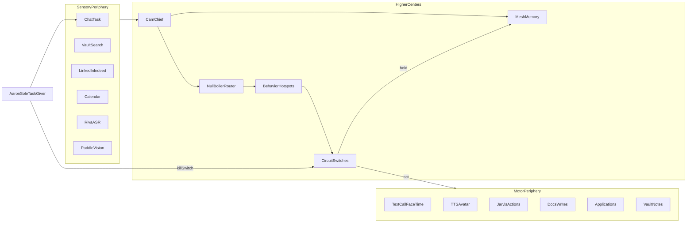

# Cam Connectome Architecture

Inspired by Berg et al., *Cell* (2026): *Sexual dimorphism in the complete Drosophila male central nervous system connectome*  
DOI: [10.1016/j.cell.2026.08.015](https://doi.org/10.1016/j.cell.2026.08.015)

Biological takeaway we copy:

1. **Shared sensory/motor periphery** — inputs and effectors are mostly common pathways  
2. **Specialized higher centers** — routing, identity, and policy live centrally  
3. **Hotspots** — dense specialized subgraphs for high-value behaviors  
4. **Circuit switches** — same sense, different motor outcome via antagonistic routes  
5. **Full sensory → motor chains** — every action is traceable from stimulus to effector  

Cam implements that as software connectome configs under `config/connectome/`.

## Layer map (fly CNS → Cam)

| Fly connectome idea | Cam system |
|---|---|
| Sensory neurons (eyes, antennae, etc.) | Input adapters: chat, vault, email, LinkedIn/Indeed, calendar, ASR, vision |
| Nerve cord / motor periphery | Effectors: text, call, FaceTime, Jarvis CLI, docs writers, job submitters, TTS/avatar |
| Higher brain centers | Cam chief + specialists + nullboiler policy + mesh/vault memory |
| Cell types (~11k typed neurons) | Typed roles / subagents with contracts (`config/roles/`) |
| Synapses | Routed events on nulltickets (claim → events → transition) |
| fruitless / doublesex markers | Persona + standing-autonomy tags (`config/persona/`, `identity/BOUNDARIES.md`) |
| Dimorphic circuit switches | Antagonistic routes: `act` vs `hold`, `send` vs `draft`, kill-switch |
| Male-specific hotspots | Careers, research, presence, life-ops denser routing hubs |
| Proofread annotations | QA role + logged run events |

## End-to-end flow



## Sensory periphery (`config/connectome/sensory.json`)

Shared receptors. They do **not** decide behavior; they only emit typed spikes (events).

Examples:

- `sense.chat.aaron` — Aaron message / task  
- `sense.vault.hit` — smart-second-brain retrieval  
- `sense.careers.listing` — LinkedIn/Indeed item  
- `sense.calendar.event` — schedule signal  
- `sense.audio.transcript` — RIVA ASR  
- `sense.vision.detection` — PaddleDetection distillate  

## Higher centers (`config/connectome/centers.json`)

Where specialization lives (paper: dimorphism concentrates centrally).

| Center | Analog | Cam role |
|---|---|---|
| `center.chief` | Central complex / executive | Cam `chief` |
| `center.memory` | Mushroom-body-like association | `memory-curator` + mesh + vault |
| `center.research` | Evidence hotspot | `researcher` |
| `center.careers` | Opportunity hotspot | `careers` |
| `center.ops` | Life-ops hotspot | `ops` |
| `center.comms` | Social-motor planning | `comms` |
| `center.docs` | Document planning | `docs` |
| `center.vision` | Visual association | `vision` |
| `center.qa` | Proofreading / consistency | `qa` |
| `center.router` | Policy neuropil | nullboiler |
| `center.agi_scan` | Daily AI/AGI scan team | `agi-scout` (+ analyst/synthesist) |
| `center.enhance` | Enhancement proposals / gated apply | `capability-broker` |
| `center.capability` | Task completion brokerage | `capability-broker` |
| `center.info` | Cited information gather | `info-retriever` |
| `center.slm` | Small-LM cortex | `slm-runtime` |
| `center.dl` | Deep-learning cortex | `dl-enhance` |

Recursive subagents = local interneuron bursts (**unlimited**; all teams may spawn).

## Circuit switches (`config/connectome/switches.json`)

Paper: isomorphic sensory paths diverge via switches into antagonistic circuits.

| Switch | Default | Act route | Hold route |
|---|---|---|---|
| `switch.tasking` | Aaron-only | accept spike | ignore non-Aaron |
| `switch.autonomy` | standing ON | finish end-to-end | pause / ask Aaron |
| `switch.outbound` | autonomy | send/call/FaceTime | draft-only |
| `switch.careers_submit` | autonomy | submit application | keep draft |
| `switch.presence` | on-demand studio | ASR→Cam→TTS→Audio2Face | still portrait / text |
| `switch.research_scan` | standing ON | web_fetch + vault/mesh distill | pause daily scan |
| `switch.cam_enhance` | **hold** (Aaron) | apply Cam functionality | propose-only |
| `switch.slm_local` | standing ON | motor.slm | no local sLM |
| `switch.dl_local` | standing ON | motor.dl | no local DL |
| `switch.kill` | armed | all motor silenced | — |

Aaron flips switches; Cam does not accept other operators. Aaron has ultimate say on functionality apply.

## Motor periphery (`config/connectome/motor.json`)

Effectors fire only after a switch resolves to **act**.

| Effector | Output |
|---|---|
| `motor.text` | SMS / iMessage / chat |
| `motor.call` | Phone call |
| `motor.facetime` | FaceTime |
| `motor.speak` | RIVA TTS + avatar face |
| `motor.jarvis` | Local CLI utilities |
| `motor.docs` | File/doc writes |
| `motor.jobs` | LinkedIn/Indeed apply |
| `motor.vault` | Obsidian note writes |
| `motor.calendar` | Calendar mutations |
| `motor.mesh` | Mesh KV puts / archives |
| `motor.web_fetch` | Fetch papers/findings (AGI scan / info) |
| `motor.enhance` | Apply Cam config/role/connectome/sLM-DL changes (Aaron-gated) |
| `motor.slm` | Local small-LM inference |
| `motor.dl` | Local DL embed/rerank/cluster |

## Hotspots (dense specialized subgraphs)

From the paper’s “male-specific connection hotspots” idea — Cam densifies routing here:

1. **Careers hotspot** — boards → rank → draft/submit → vault/careers  
2. **Research hotspot** — question → vault+web → cited brief → mesh/research  
3. **AGI daily scan hotspot** — clock/arxiv/feeds → agi_scan → enhance proposals → vault  
4. **Capability hotspot** — Aaron task → capability team → specialists/sLM/DL → done  
5. **Info hotspot** — question → vault→mesh→web → cited answer  
6. **sLM / DL hotspots** — local model assists + feedback into mesh  
7. **Presence hotspot** — transcript → Cam reply → soft airy fluent English TTS → face  
8. **Life-ops hotspot** — calendar/chores → Jarvis/calendar motor  

Defined in `config/connectome/hotspots.json`. See also [CAM_BRAIN.md](CAM_BRAIN.md) and [AGI_RESEARCH_TEAM.md](AGI_RESEARCH_TEAM.md).

## Synapse protocol (implementation contract)

Every connection is a nulltickets-backed event:

```text
sense.*  --spike-->  center.*  --route-->  switch.*  --act|hold-->  motor.*
                 \--log--> run events + mesh
```

Rules:

1. No motor fire without a sensory or internal drive spike tied to an Aaron task/goal  
2. Every synapse writes an event (proofreading analog)  
3. QA can veto malformed chains before motor  
4. Kill switch severs all motor edges immediately  

## Runtime mapping to Null stack

| Connectome piece | Runtime |
|---|---|
| Synaptic cleft / durable graph | nulltickets |
| Routing policy | nullboiler |
| Neuron executors | nullclaw roles |
| Human master switch | Aaron (+ nullhub when live) |
| Long-term engram | smart-second-brain vault + mesh |
| Embodied voice/face motor | LLMAvatarTalk |

## Why this shape

- Matches the paper: periphery shared, center specialized, switches decide behavior  
- Keeps Cam efficient: specialists only in hotspots  
- Makes motor output **correspond** to mapped pathways, not ad-hoc tool calls  
- Preserves Aaron as the only task-giver while allowing standing autonomy on granted act routes  

## Live visualization

Interactive brain + spinal cord map with forward motor effects and feedback return:

- `visualizations/connectome/index.html`
- Serve: `bash scripts/serve-connectome-viz.sh` → http://127.0.0.1:8765/visualizations/connectome/

All wired repos light up as pathways fire (nullclaw, nulltickets, nullboiler, nullhub, Jarvis, PaddleDetection, LLMAvatarTalk, smart-second-brain, OpenClaw/Assistant- patterns).

## Files

- `config/connectome/sensory.json`  
- `config/connectome/centers.json`  
- `config/connectome/switches.json`  
- `config/connectome/motor.json`  
- `config/connectome/hotspots.json`  
- `config/connectome/synapses.json` — allowed sense→center→motor edges  
- `scripts/connectome-route.py` — validates/routes a spike through the map  

## Source

Berg et al., Cell 2026; vault brief: `vault/04-Research/2026-09-16-Drosophila-male-CNS-connectome-Cell.md`
